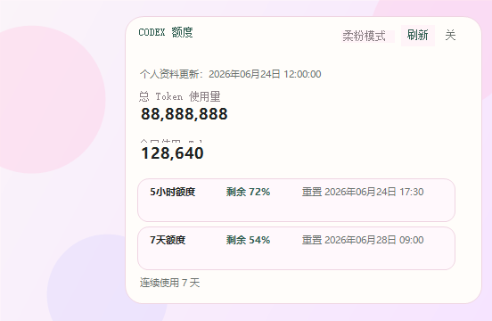

# Codex 额度查看小窗口

> English: Codex Quota Viewer Mini Window

一个适用于 Windows 的 Codex 桌面小窗口，用于查看总 Token 使用量、今日 Token 使用量、5 小时额度、7 天额度和连续使用天数。

English: A small Windows desktop companion for viewing Codex lifetime and daily token usage, 5-hour and 7-day quota windows, and the current usage streak.



## 安全与隐私说明 / Security & Privacy

本工具会在本机读取 Codex 登录状态文件：

```text
%USERPROFILE%\.codex\auth.json
```

读取到的 `access_token` 只会作为 HTTPS 请求头发送到 `chatgpt.com`，用于读取当前账号的 Codex 使用统计。本工具还会通过 `127.0.0.1` 临时连接本机 Codex app-server，以读取额度窗口。

本工具不会：

- 在窗口、控制台或日志中输出 access token。
- 将 access token 写入项目文件、缓存文件或配置文件。
- 将 token 或使用统计发送到第三方服务器。
- 注册开机自启动任务。

本工具会读取本机 Codex session 日志作为额度数据的备用来源，但不会上传这些日志。启动后，小窗口进程会留在当前 Windows 会话中：Codex 关闭时隐藏，Codex 再次运行时显示。你可以从托盘菜单选择“退出”彻底关闭。

建议运行前自行审查 [`scripts/Get-CodexQuotaSnapshot.ps1`](scripts/Get-CodexQuotaSnapshot.ps1) 和 [`scripts/Start-CodexQuotaWidget.ps1`](scripts/Start-CodexQuotaWidget.ps1)。

English: The tool reads the existing Codex login token in memory and sends it only to the official `chatgpt.com` HTTPS host for profile statistics. It does not print, persist, log, or send the token to third parties. Local Codex session logs are fallback-only and are never uploaded.

> 注意：本项目不是 OpenAI 官方产品，使用的个人资料后台接口可能随 Codex 或 ChatGPT 更新而变化。
>
> English: This is not an official OpenAI product. The profile backend endpoint may change in future Codex or ChatGPT releases.

## 功能 / Features

- 显示总 Token 使用量和今日 Token 使用量。
- 显示 5 小时、7 天额度剩余比例和重置时间。
- 显示连续使用天数。
- 手动刷新，并每 10 分钟自动强制刷新。
- 重复点击桌面图标只保留一个窗口。
- Codex 运行时显示，Codex 关闭时自动隐藏。
- 支持本机私有自定义图片，不把图片上传到仓库。
- 不估算费用，也不推断隐藏的绝对额度。

English: Shows token statistics, quota windows, reset times, streak days, manual and 10-minute refresh, single-instance behavior, Codex-aware visibility, and optional local-only custom artwork.

## 三步快速开始 / Quick Start

### 1. 下载并解压 / Download

下载项目 ZIP，并将目录解压或重命名为：

```text
%USERPROFILE%\plugins\codex-quota-widget
```

### 2. 创建桌面快捷方式 / Create Shortcut

双击：

```text
scripts\Install-DesktopShortcut.cmd
```

也可以在 PowerShell 中运行：

```powershell
powershell.exe -NoProfile -ExecutionPolicy Bypass -File "$env:USERPROFILE\plugins\codex-quota-widget\scripts\Install-DesktopShortcut.ps1"
```

### 3. 启动 / Launch

先打开并登录 Codex，然后双击桌面的“Codex额度查看小窗口”。

English: Extract the project to `%USERPROFILE%\plugins\codex-quota-widget`, run `scripts\Install-DesktopShortcut.cmd`, then launch Codex and double-click the desktop shortcut.

## 为什么使用 ExecutionPolicy Bypass？

`-ExecutionPolicy Bypass` 只作用于本次 PowerShell 进程，不会永久修改 Windows 的执行策略。它用于避免下载的本地脚本被默认策略直接阻止，不会绕过 Windows 用户权限或安全边界。

如果你不希望使用 Bypass，可以先审查脚本，然后选择当前用户范围的替代方案：

```powershell
Set-ExecutionPolicy -Scope CurrentUser RemoteSigned
Get-ChildItem "$env:USERPROFILE\plugins\codex-quota-widget" -Recurse | Unblock-File
powershell.exe -NoProfile -File "$env:USERPROFILE\plugins\codex-quota-widget\scripts\Start-CodexQuotaWidget.ps1"
```

English: `Bypass` applies only to the launched PowerShell process and does not permanently change system policy. `RemoteSigned` plus `Unblock-File` is an optional current-user alternative.

## 数据来源 / Data Sources

| 数据 | 来源 |
|---|---|
| 总 Token、今日 Token、连续使用天数 | `https://chatgpt.com/backend-api/wham/profiles/me` |
| 5 小时、7 天额度窗口 | 本机 Codex app-server：`account/rateLimits/read` |
| 备用额度数据 | `%USERPROFILE%\.codex\sessions\**\*.jsonl` |

English: Profile statistics come from the ChatGPT backend on the official domain. Quota windows prefer the local Codex app-server, with local session files as fallback.

## 本机自定义素材 / Local Custom Assets

公开仓库不附带第三方角色图、头像、Logo 或同人图。默认界面使用项目原创通用图标。

如果你拥有图片使用权，可以把自定义素材放在：

```text
%LOCALAPPDATA%\CodexQuotaWidget\assets
```

支持的文件名：

```text
character-card.png
character.png
logo.png
icon.ico
```

程序优先使用本机私有目录，缺失时自动使用仓库默认素材。设置环境变量 `CODEX_QUOTA_USE_BUNDLED_ASSETS=1` 可临时只使用公开默认素材。

English: Public releases contain no third-party character artwork. Licensed personal assets may be placed in `%LOCALAPPDATA%\CodexQuotaWidget\assets`; they remain outside Git.

## 常见问题 / FAQ

### 为什么窗口没有显示？

请确认 Codex 正在运行。小窗口在 Codex 关闭时会自动隐藏。再次双击桌面快捷方式可以唤醒已有实例。

### 为什么 Token 显示为空？

先确认 Codex 已登录并正常联网，然后使用一次 Codex，再点击“刷新”。个人资料统计有时会有短暂延迟。

### 为什么提示“未找到 Codex 程序”？

请确认 Windows 版 Codex 已安装。如果使用了非默认安装位置，可以设置 `CODEX_CLI_PATH` 指向 `codex.exe`。

### 为什么读取个人资料失败？

可能是网络异常、Codex 登录已过期，或个人资料后台接口发生变化。重新登录 Codex 后再刷新。

### 为什么额度窗口读取失败？

可能是当前 Codex 版本不支持对应 app-server 方法，或临时 app-server 启动失败。更新 Codex 后重试；Token 总量仍可单独显示。

### 为什么 PowerShell 阻止运行？

使用快速开始中的临时 `Bypass` 命令，或采用 `RemoteSigned` 和 `Unblock-File` 替代方案。

English: The FAQ covers hidden windows, empty token values, missing Codex installations, profile failures, quota-window failures, and PowerShell policy blocks.

## 手动运行 / Manual Commands

启动窗口：

```powershell
powershell.exe -NoProfile -ExecutionPolicy Bypass -File "$env:USERPROFILE\plugins\codex-quota-widget\scripts\Start-CodexQuotaWidget.ps1"
```

读取 JSON 快照：

```powershell
powershell.exe -NoProfile -ExecutionPolicy Bypass -File "$env:USERPROFILE\plugins\codex-quota-widget\scripts\Get-CodexQuotaSnapshot.ps1" -Json -ForceProfileRefresh
```

## 项目结构 / Project Structure

```text
.codex-plugin/plugin.json
assets/
scripts/
skills/codex-quota-widget/SKILL.md
tests/Run-Tests.ps1
LICENSE
RELEASE_NOTES.md
```

## 开发与验证 / Development

运行测试：

```powershell
powershell.exe -NoProfile -ExecutionPolicy Bypass -File ".\tests\Run-Tests.ps1"
```

重新生成公开默认图标：

```powershell
powershell.exe -NoProfile -ExecutionPolicy Bypass -File ".\scripts\Build-DefaultAssets.ps1"
```

生成发布 ZIP：

```powershell
powershell.exe -NoProfile -ExecutionPolicy Bypass -File ".\scripts\Build-Release.ps1"
```

后续维护可以考虑拆分 UI、绘图和数据访问模块；`v0.2.0` 不进行大规模 UI 重构。

## License

代码使用 [MIT License](LICENSE)。

用户自行放入本机私有目录的图片不属于本项目，也不受 MIT License 覆盖。请确保你拥有相应的使用权和再分发授权。

English: Source code is licensed under MIT. User-supplied artwork is separately licensed and remains the user's responsibility.
